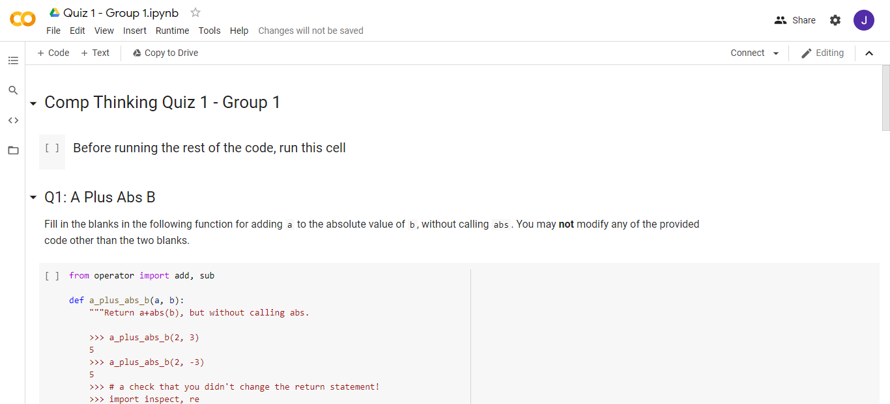

# Comp Thinking Quiz 1

## Guidelines

- The duration of the quiz is 1 hour.
- You are not allowed to consult anyone, including consulting on the Internet.
- Please turn on your camera throughout the duration of the quiz.

## Instruction

- If you are in Group 1 (Pak Budi), click on this [link](https://colab.research.google.com/drive/1K9LAi3nNDEPspY2ic-il5RDmcKaLwh6m). If you are in Group 2 (Jason), click on this [link](https://colab.research.google.com/drive/1n3e2L-r8kax23ACzgiW91TnfG_1M0lDG).

- Upon opening the Google Colab notebook, click on the `Copy to Drive` button. You may be asked to log in to your Google account. 
- When you have finished attempting the quiz, click on `File > Download .py`.
- Rename the Python file to `ct_quiz1_<your_group>_<your_name>.py` (for example, `ct_quiz1_group1_jason.py`).
- Email the file to `jasonnsebastian@gmail.com`.
